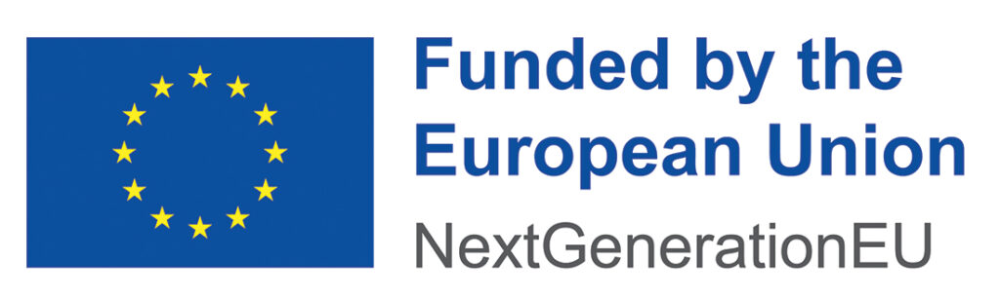

LeQua 2024 is supported 
* by the [SoBigData++](https://plusplus.sobigdata.eu) project, funded by the European Commission (Grant 871042) under the H2020 Programme INFRAIA-2019-1;
* by the [AI4Media](https://www.ai4media.eu) project, funded by the European Commission (Grant 951911) under the H2020 Programme ICT-48-2020;
* by the FAIR and QuaDaSh projects, funded by the European Commission under the [NextGenerationEU](https://next-generation-eu.europa.eu/index_en) funding scheme.
The organizers' opinions do not necessarily reflect those of the European Commission.

<!-- BEGIN COMMENTED BLOCK

END COMMENTED BLOCK -->

&nbsp;&nbsp;&nbsp;&nbsp;&nbsp;&nbsp;&nbsp;&nbsp;&nbsp;&nbsp;&nbsp;&nbsp;&nbsp;&nbsp;&nbsp;&nbsp;
&nbsp;&nbsp;&nbsp;&nbsp;&nbsp;&nbsp;&nbsp;&nbsp;&nbsp;&nbsp;&nbsp;&nbsp;&nbsp;&nbsp;&nbsp;&nbsp;

