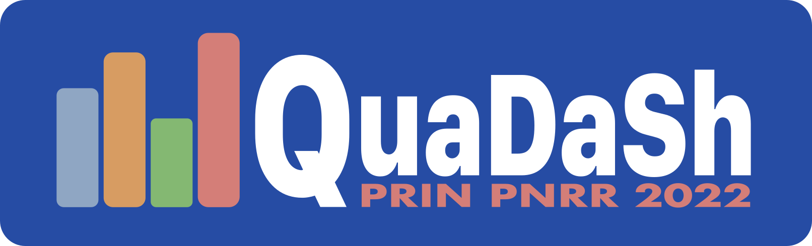

# LeQua 2024: Learning to Quantify

The aim of LeQua 2024 (the 2nd edition of the “Learning to Quantify” data challenge) is to allow the comparative evaluation of methods (based on supervised learning) for **class prior estimation** (a.k.a. **quantification**, or **learning to quantify**) in unlabelled data, i.e., methods for training predictors of the relative frequencies of the classes in sets of unlabelled datapoints. These predictors (called “quantifiers”) are required to issue predictions for several such sets, some of them affected by "dataset shift" (i.e., showing characteristics radically different from the ones of the training set). 

Register your team for participating in LeQua 2024 by filling [this form](https://forms.gle/1U8g9fP5qzzpF5TJ6). You may decide to participate in all four LeQua 2024 tasks or only in the ones you are most interested in. Please fill one form per team. There may be more than one team per institution, but a person can be a member of one LeQua 2024 team only.
  
  

## News!
<!-- BEGIN COMMENTED BLOCK
* 7 Aug 2022: The LeQua 2022 session at CLEF 2022 in Bologna, Italy will take place on Wednesday, September 7, from 15:30 to 18:50; all times are CEST.
* 30 May 2022: We are delighted to announce that the LeQua 2022 session at CLEF 2022 in Bologna will host a keynote talk by [George Forman](https://scholar.google.com/citations?hl=en&user=r0a222QAAAAJ) (Amazon Research)
* 28 May 2022: The submission period for participants' papers is now over; thanks to the teams who have submitted their papers! 
* 11 May 2022: The submission period is now over; thanks to the teams who have submitted their runs! The test set (with labels) **is now public** and accessible via [Zenodo](https://doi.org/10.5281/zenodo.5734464)! 
* 22 April 2022: The test set (with labels omitted) **is now public** and accessible via [Zenodo](https://doi.org/10.5281/zenodo.5734464)! You can now submit your results via [CodaLab](https://codalab.lisn.upsaclay.fr/competitions/4134)!
END COMMENTED BLOCK -->
* 15th Feb 2024: The dataset (training and development sets) **is now public** and accessible via [Zenodo](https://doi.org/10.5281/zenodo.10654474)
* 15th Feb 2024: The [format checker](https://github.com/HLT-ISTI/LeQua2024_scripts/blob/main/format_checker.py) and [evaluation script](https://github.com/HLT-ISTI/LeQua2024_scripts/blob/main/evaluate.py), along with other [useful functions and further guidelines](https://github.com/HLT-ISTI/LeQua2024_scripts), are public and accessible via [GitHub](https://github.com/HLT-ISTI/LeQua2024_scripts).
* 15th Feb 2024: The [Google discussion group](https://groups.google.com/g/lequa2024) has been created! If you plan to participate (and we very much hope so), visit [https://groups.google.com/g/lequa2024](https://groups.google.com/g/lequa2024) and request to become a member now!
* 18 Jan 2024: [Registrations](https://forms.gle/1U8g9fP5qzzpF5TJ6) are open! (until 31 May 2024)

<!-- BEGIN COMMENTED BLOCK
Follow us on Twitter: [@LeQua2024](https://twitter.com/LeQua2024)
END COMMENTED BLOCK -->

  

## Acknowledgments

LeQua 2024 is supported 
* by the [SoBigData++](https://plusplus.sobigdata.eu) project, funded by the European Commission (Grant 871042) under the H2020 Programme INFRAIA-2019-1;
* by the [AI4Media](https://www.ai4media.eu) project, funded by the European Commission (Grant 951911) under the H2020 Programme ICT-48-2020;
* by the FAIR and QuaDaSh projects, funded by the European Commission under the [NextGenerationEU](https://next-generation-eu.europa.eu/index_en) funding scheme.
The organizers' opinions do not necessarily reflect those of the European Commission.

    

&nbsp;&nbsp;&nbsp;&nbsp;
&nbsp;&nbsp;&nbsp;&nbsp;
&nbsp;&nbsp;&nbsp;&nbsp;

