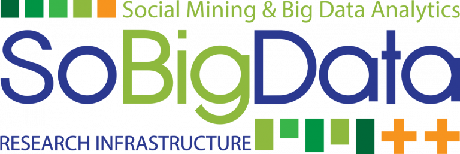

# LeQua 2024: Learning to Quantify

The aim of LeQua 2024 (the 2nd edition of the “Learning to Quantify” data challenge) is to allow the comparative evaluation of methods (based on supervised learning) for **class prior estimation** (a.k.a. **quantification**, or **learning to quantify**) in unlabelled data, i.e., methods for training predictors of the relative frequencies of the classes in sets of unlabelled datapoints. These predictors (called “quantifiers”) are required to issue predictions for several such sets, some of them affected by "dataset shift" (i.e., showing characteristics radically different from the ones of the training set). 

Register yourself and your team for participating to LeQua 2024 by filling [this form](https://forms.gle/1U8g9fP5qzzpF5TJ6). (Please fill one form per team. There may be more than one team per institution, but a person can be a member of one LeQua 2024 team only.)

For a description of the [1st edition of this data challenge](https://lequa2022.github.io/), which took place in 2022, you are welcome to download one of the following papers:
1. Andrea Esuli, Alejandro Moreo, Fabrizio Sebastiani: [LeQua@CLEF2022: Learning to Quantify](https://link.springer.com/chapter/10.1007/978-3-030-99739-7_47). Proceedings of the 44th European Conference on Information Retrieval (ECIR 2022), Stavanger, NO, pp. 374-381. This is a concise description of the data challenge published before the submissions came in, and which thus focuses only on the setup of the data challenge and does not discuss the results and the submitting systems;
1. Andrea Esuli, Alejandro Moreo, Fabrizio Sebastiani, Gianluca Sperduti: [A Concise Overview of LeQua@CLEF 2022: Learning to Quantify](https://link.springer.com/chapter/10.1007/978-3-031-13643-6_23). Proceedings of the 13th Conference and Labs of the Evaluation Forum (CLEF 2022), Bologna, IT, pp. 362-381. This is as paper (1) above, but published after the submissions came in, which means it also discusses the results and the submitting systems;
1. Andrea Esuli, Alejandro Moreo, Fabrizio Sebastiani, Gianluca Sperduti: [A Detailed Overview of LeQua@CLEF 2022: Learning to Quantify](https://ceur-ws.org/Vol-3180/paper-146.pdf). Working Notes of the 13th Conference and Labs of the Evaluation Forum (CLEF 2022), Bologna, IT, pp. 1849-1868. This is as paper (2) above, but much more detailed.

If you are interested in research on learning to quantify, you might want to check 
* a [2023 book](https://link.springer.com/book/10.1007/978-3-031-20467-8) (published open-access by Springer Nature) on learning to quantify, by Andrea Esuli, Alessandro Fabris, Alejandro Moreo, and Fabrizio Sebastiani;
* a [2017 survey](https://dl.acm.org/doi/10.1145/3117807) of research on learning to quantify, by Pablo González, Alberto Castaño, Nitesh V. Chawla, and Juan José del Coz, published on ACM Computing Surveys;
* the [proceedings](http://ceur-ws.org/Vol-3052/) of the [1st International Workshop on Learning to Quantify (LQ 2021)](https://cikmlq2021.github.io/); a report of that workshop has also been published as [Juan José del Coz, Pablo González, Alejandro Moreo, and Fabrizio Sebastiani.  Report on the 1st International Workshop on Learning to Quantify (LQ 2021). SIGKDD Explorations 24(1):49--51, 2022.](http://kdd.org/exploration_files/vol24issue1_4._Report_on_the_1st_International_Workshop_on_Learning_to_Quantify_%28LQ_2021%29.pdf)
* the [proceedings](https://lq-2022.github.io/proceedings/CompleteVolume.pdf) of the [2nd International Workshop on Learning to Quantify (LQ 2022)](https://lq-2022.github.io/); 
* the [proceedings](http://tinyurl.com/2vf2z63z) of the [3rd International Workshop on Learning to Quantify (LQ 2023)](https://lq-2023.github.io/);
* [4 videorecordings, 90 mins each](https://www.youtube.com/channel/UCq-2Htqn57uXjtwzy6PJ1pA), of a 2023 course on learning to quantify (including lectures + a hands-on session) delivered by Alejandro Moreo and Fabrizio Sebastiani;
* the [QuaPy](https://github.com/HLT-ISTI/QuaPy) open-source Python library for learning to quantify. For participating in this data challenge you are welcome to use QuaPy and its tools in any way you might deem suitable.  Check paper [Alejandro Moreo, Andrea Esuli, and Fabrizio Sebastiani. QuaPy: A Python-based framework for quantification. Proceedings of the 30th ACM International Conference on Knowledge Management (CIKM 2021), Gold Coast, AU, pp. 4534–4543.](https://dl.acm.org/doi/10.1145/3459637.3482015) to learn more about QuaPy.
  
    

## News!
<!-- BEGIN COMMENTED BLOCK
* 7 Aug 2022: The LeQua 2022 session at CLEF 2022 in Bologna, Italy will take place on Wednesday, September 7, from 15:30 to 18:50; all times are CEST.
* 30 May 2022: We are delighted to announce that the LeQua 2022 session at CLEF 2022 in Bologna will host a keynote talk by [George Forman](https://scholar.google.com/citations?hl=en&user=r0a222QAAAAJ) (Amazon Research)
* 28 May 2022: The submission period for participants' papers is now over; thanks to the teams who have submitted their papers! 
* 11 May 2022: The submission period is now over; thanks to the teams who have submitted their runs! The test set (with labels) **is now public** and accessible via [Zenodo](https://doi.org/10.5281/zenodo.5734464)! 
* 22 April 2022: The test set (with labels omitted) **is now public** and accessible via [Zenodo](https://doi.org/10.5281/zenodo.5734464)! You can now submit your results via [CodaLab](https://codalab.lisn.upsaclay.fr/competitions/4134)!
* 1st Dec 2021: The dataset (training and development sets) **is now public** and accessible via [Zenodo](https://www.doi.org/10.5281/zenodo.5734465)
* 1st Dec 2021: The [format checker](https://github.com/HLT-ISTI/LeQua2022_scripts/blob/main/format_checker.py) and [evaluation script](https://github.com/HLT-ISTI/LeQua2022_scripts/blob/main/evaluate.py), along with other [useful functions and further guidelines](https://github.com/HLT-ISTI/LeQua2022_scripts), are public and accessible via [GitHub](https://github.com/HLT-ISTI/LeQua2022_scripts).
* 1st Dec 2021: The [Google discussion group](https://groups.google.com/g/lequa2022) has been created! If you plan to participate (and we very much hope so), visit [https://groups.google.com/g/lequa2022](https://groups.google.com/g/lequa2022) and request to become a member now!
END COMMENTED BLOCK -->
* 18 Jan 2024: [Registrations](https://forms.gle/1U8g9fP5qzzpF5TJ6) are open! (until 31 May 2024)

<!-- BEGIN COMMENTED BLOCK
Follow us on Twitter: [@LeQua2024](https://twitter.com/LeQua2024)
END COMMENTED BLOCK -->

    

LeQua 2024 is supported 
* by the [SoBigData++](https://plusplus.sobigdata.eu) project, funded by the European Commission (Grant 871042) under the H2020 Programme INFRAIA-2019-1;
* by the [AI4Media](https://www.ai4media.eu) project, funded by the European Commission (Grant 951911) under the H2020 Programme ICT-48-2020;
* by the QuaDaSh project, funded by the European Commission under the NextGenerationEU funding scheme.
The organizers' opinions do not necessarily reflect those of the European Commission.

&nbsp;&nbsp;&nbsp;&nbsp;&nbsp;&nbsp;&nbsp;&nbsp;

<!-- BEGIN COMMENTED BLOCK

END COMMENTED BLOCK -->
